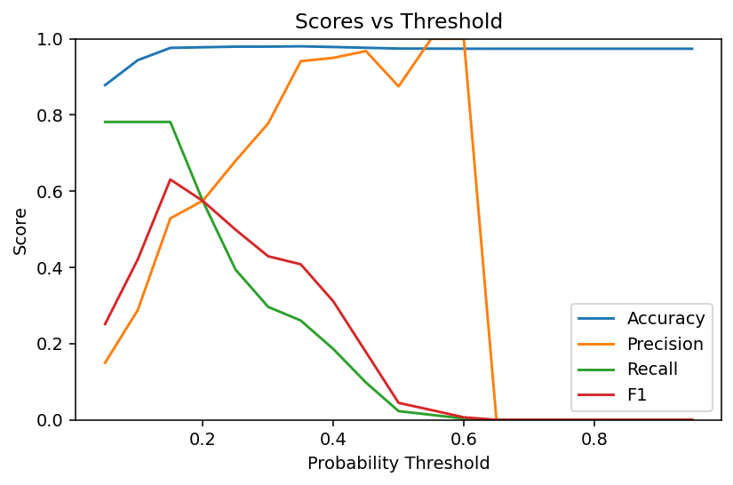

🛒 PriceSense – Prediction & Evaluation

This add-on provides price forecasting, fake-review scoring, and model evaluation visuals on top of the artifacts you generated with the trainer.

It is designed to work directly with your Flipkart CSV:

C:\Users\sagni\Downloads\Price Sense\archive\flipkart_com-ecommerce_sample.csv

and read/write artifacts in:

C:\Users\sagni\Downloads\Price Sense\

📦 Files

Training (from earlier step)

price_lstm.h5 — Keras LSTM model (or placeholder if TF was absent)

fake_review_lr.pkl — Logistic Regression fake-review model

metrics.json — training metrics

config.yaml — training config snapshot

Prediction

pricesense_predict.py — forecasts price for a chosen product, scores fake reviews, and saves plots/CSVs

Evaluation

pricesense_eval.py — evaluates the fake-review model; saves accuracy graph and heatmap (plus ROC/PR)

🧰 Prerequisites

Create a virtual environment and install dependencies (PowerShell):

python -m venv .venv
. .venv\Scripts\Activate.ps1
pip install numpy pandas scikit-learn matplotlib PyYAML
# Optional for true LSTM inference (heavy):
# pip install tensorflow==2.15.*

If TensorFlow isn’t installed, forecasting still works via a moving-average fallback.
Ensure h5py is installed if you plan to retrain/export .h5 in other scripts: pip install h5py.

🗂 Project Layout (relevant parts)
Price Sense\
├─ archive\
│  └─ flipkart_com-ecommerce_sample.csv
├─ price_lstm.h5
├─ fake_review_lr.pkl
├─ metrics.json
├─ config.yaml
├─ pricesense_predict.py
└─ pricesense_eval.py

🚀 Quick Start
1) Prediction & Visualization

Run:

python pricesense_predict.py

What it does:

Loads flipkart_com-ecommerce_sample.csv

Picks a product by title substring (default: "phone") or index

Reconstructs a synthetic 60-day price history (same logic as the trainer)

Loads price_lstm.h5 (if TF available) or uses a moving-average fallback

Forecasts the next 7 days

Builds review snippets from description/title and scores fake-review probabilities via fake_review_lr.pkl

Saves outputs to your artifacts folder

Outputs created:

C:\Users\sagni\Downloads\Price Sense\
  ├─ price_forecast.png          # History + forecast line chart
  ├─ price_forecast.csv          # Dates + predicted prices
  ├─ fake_review_scores.csv      # Suspicious probabilities per snippet
  └─ sentiment_pie.png           # Simple rule-based sentiment pie (optional)

Customize selection:

Open pricesense_predict.py and edit these constants:

PRODUCT_QUERY = "phone"  # substring search in product title (case-insensitive)
PRODUCT_INDEX = 0        # fallback if query finds nothing
FORECAST_DAYS = 7
SEED_DAYS = 60           # keep aligned with the training script
SEQ_LEN = 7              # keep aligned with the training script

If PRODUCT_QUERY matches multiple items, the first match is used.

Set PRODUCT_QUERY = None to pick by PRODUCT_INDEX.

Tip (Windows paths): Use raw strings like r"C:\Users\..." to avoid unicodeescape errors.

2) Model Evaluation (Fake-Review Classifier)

Run:

python pricesense_eval.py

What it does:

Re-creates review snippets from the CSV (same heuristics used during training)

Loads fake_review_lr.pkl

Splits into train/test and evaluates on the test set

Prints accuracy, precision, recall, F1, and AUC

Saves the following plots:

C:\Users\sagni\Downloads\Price Sense\
  ├─ confusion_matrix.png        # Heatmap (normalized)
  ├─ roc_curve.png               # ROC + AUC
  ├─ pr_curve.png                # Precision–Recall + AP
  └─ accuracy_vs_threshold.png   # Accuracy / Precision / Recall / F1 vs threshold

📊 What the Visuals Show

price_forecast.png – Previous 60 days (synthetic) and next N days forecast.

fake_review_scores.csv – For each review snippet, a probability (0–1) that it’s suspicious.

confusion_matrix.png – Normalized heatmap of true vs predicted labels on the held-out test split.

accuracy_vs_threshold.png – How metrics vary as you change the classification threshold (default 0.5).

⚙️ Configuration Hints

TensorFlow optional: If not installed or model fails to load, the script uses a robust moving-average fallback for forecasts.

Match training settings: Keep SEED_DAYS and SEQ_LEN aligned with the values used in training for more consistent behavior.

CSV encoding: The scripts try utf-8 first, then latin1 as fallback.

🧪 Reproducibility

Both scripts fix numpy and Python RNG via:

np.random.seed(42)
random.seed(42)

Synthetic price histories will be repeatable across runs (given the same base price).
Author
SAGNIK PATRA
